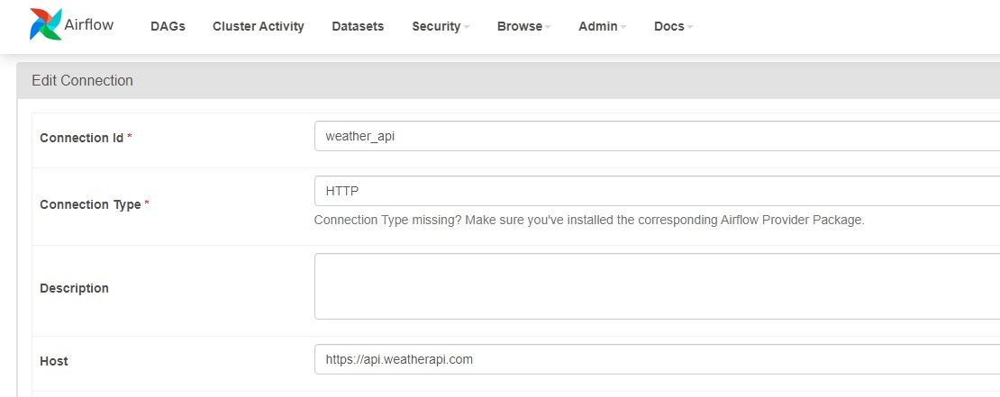
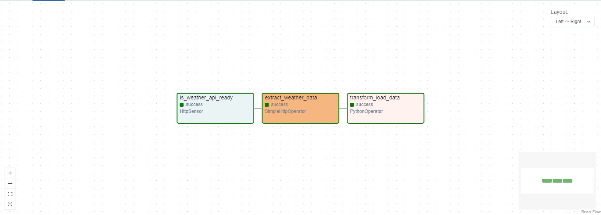
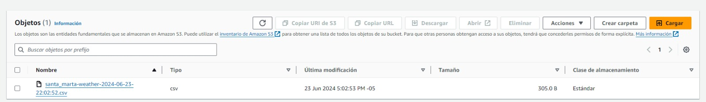

# Weather Data Pipeline

This project uses WeatherAPI to fetch weather data, processes it into a DataFrame, and saves it to an S3 bucket using Apache Airflow on an EC2 instance.

## Setup

### Clone the repository

`git clone https://github.com/yourusername/weather-data-pipeline.git`

### EC2 instance setup

1. Launch an EC2 instance with IAM role that has access to S3
2. Edit inbound rules (TCP 8080 for airflow webserver)
3. Connect to the EC2 instance

### Install dependencies on EC2

`sudo apt update`

`sudo apt install python3-pip`

`sudo apt install python3.12-venv`

`python3 -m venv venv`

`source venv/bin/activate`

`sudo venv/bin/pip install pandas s3fs apache-airflow`

### Run Airflow

`airflow standalone`

### Go to Airflow

your-ec2-public-ipv4-addres:8080 on a browser

### Login

You will see your Airflow credentials in the terminal where you ran `airflow standalone`

### Add http connection in Airflow

- Connection Id: weather_api
- Connection Type: HTTP
- Host: https://api.weatherapi.com

### Add the file weather_dag.py

1. Go to the Airflow folder
2. Create a new folder called exactly *dags* else you have to change the airflow.cfg file
3. Put the code inside this *dags* folder

### Running the Pipeline

1. Trigger the `weather_data_pipeline` DAG (weather_dag).

2. Verify the data is saved in your S3 bucket.

## Troubleshooting

- **API Key Issues**: Ensure your WeatherAPI key is valid and has sufficient quota.
- **S3 Access Issues**: Verify your EC2 instance's IAM role has the necessary S3 permissions.
- **Airflow Errors**: Check Airflow logs for any errors and resolve dependencies as needed.

## Conclusion

This project demonstrates a simple ETL pipeline using WeatherAPI, Airflow, and AWS S3 on an EC2 instance. Feel free to extend this pipeline to include more complex data processing and integrations.